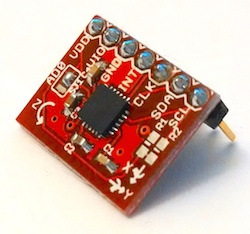
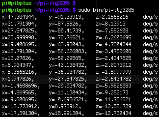
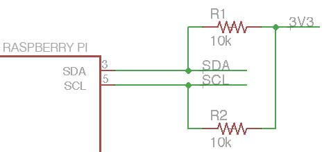
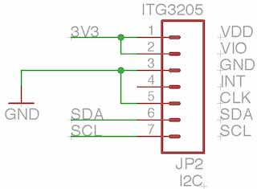
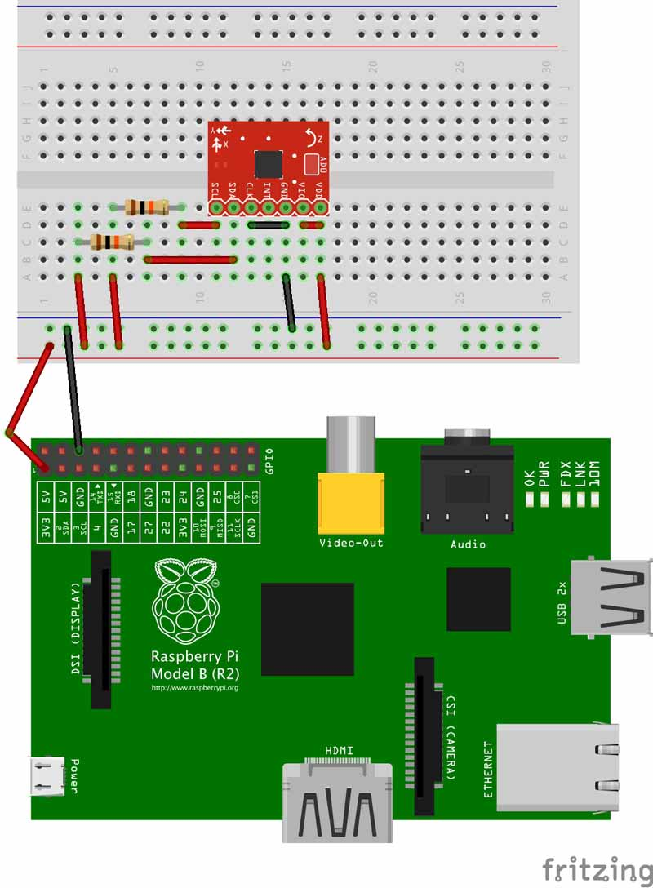

# Screenshot


# Instructions
## Schematic



## Wiring


## Computer
* Compile project
  * OS X/Linux: `$ ./gradlew distZip`
  * Windows `gradlew.bat distZip`
* ZIP file will be located in build/distributions
* Copy pi-itg3205.zip to your Raspberry Pi

## Raspberry Pi
```bash
$ unzip pi-itg3205.zip
$ cd pi-itg3205
$ sudo bin/pi-itg3205
```
